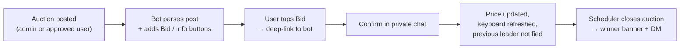

<div align="center">

# 🎮 Telegram Auction Bot

**Add the bot to your Telegram channel and run live, interactive auctions straight from the bot.**

A lightweight Node.js bot that posts and manages auctions in your channel — each with inline **Bid** & **Info** buttons — tracking participants and the current price, and automatically closing with a winner banner at the scheduled time.

[](https://nodejs.org)
[](https://github.com/WiseLibs/better-sqlite3)
[](https://core.telegram.org/bots/api)


**🌐 Language:** **English** · [Українська](README.uk.md)

</div>

---

## 📖 Table of Contents

- [Highlights](#-highlights)
- [Features](#-features)
- [How It Works](#-how-it-works)
- [Bot Commands](#-bot-commands)
- [Admin Panel](#-admin-panel)
- [Configuration](#-configuration)
- [Creating an Auction](#-creating-an-auction)
- [Photo Watermark](#-photo-watermark)
- [Tech Stack](#-tech-stack)
- [Project Layout](#-project-layout)
- [Getting Started](#-getting-started)
- [License](#-license)

---

## ⭐ Highlights

|  | |
|---|---|
| 🕒 **Continuous auctions** | Auto-extends the deadline on last-minute bids to stop sniping. |
| 🏷️ **Live status hashtag** | Header is tagged `#active` while open and flips to `#finished` on close. |
| 🌍 **Bilingual** | Full Ukrainian & English UI, switchable from the admin panel. |
| 🤖 **AI generation** | Generate titles & descriptions from a photo with OpenAI. |
| 🔔 **Smart notifications** | Outbid alerts, custom reminders, and auto 30-min warnings. |
| 📝 **User submissions** | Users propose lots; admins review, edit, and approve. |
| 🖼 **Photo watermark** | Stamp your own PNG onto the main photo of every auction you post. |
| 🛡️ **OTP-secured panel** | Full auction & settings management behind one-time-password auth. |

---

## ✨ Features

<details open>
<summary><b>Bidding & auctions</b></summary>

- **One-tap bidding with confirmation** — users are deep-linked from the channel to the bot's private chat to confirm, preventing accidental bids.
- **Continuous auctions** — a bid placed near the deadline extends the end time (e.g. +5 min), preventing last-second sniping.
- **Quick outbid response** — outbid notifications include a "Quick Bid" button to re-raise in a single tap.
- **Interactive Info button** — reveals recent bidders in a short alert, collapsing consecutive bids from the same user.
- **Robust scheduled closing** — powered by `node-schedule`; restores jobs on restart and posts a winner (or "no bids") banner.
- **Live status hashtag** — the post header is tagged `#active` (`#активний`) while bidding is open and automatically flipped to `#finished` (`#завершений`) when the auction closes, in the bot's language. Restarting a finished auction flips it back.

</details>

<details>
<summary><b>Users & engagement</b></summary>

- **Subscriptions & custom reminders** — subscribe to any auction and set reminders (1h / 2h / 3h / 6h / 12h before closing).
- **Automatic end-of-auction warning** — a 30-minute heads-up is sent to all active participants.
- **Real-time notifications** — private messages on being outbid or winning.
- **Portfolio & watchlist** — `/menu` shows active bids, history, and watched auctions.
- **Automatic winner contact** — winners get the admin's contact and a link back to the post.
- **User-submitted auctions** — submit lots via the bot with per-user limits, an optional rules-confirmation step, and a global on/off toggle.

</details>

<details>
<summary><b>Admin & customization</b></summary>

- **Advanced admin panel** — OTP-authenticated private panel to manage auctions, submissions, and all settings.
- **Auction posting wizard** — step-by-step creation (photo → title → price → step → end date → continuous → contact).
- **AI auction generation** — OpenAI (`gpt-4.1-mini`) turns an uploaded photo into a professional title and description.
- **Customizable templates** — edit the post header, footer, and every field label from the bot.
- **Custom currency** — any symbol or name (₴, $, €, BTC, …) used across all auctions.
- **Rich media support** — shows the auction's photo and full original text at the confirmation step.
- **Smart parsing** — extracts lot name, min bid, step, and end time from posts with dynamic regex that adapts to custom labels.

</details>

---

## 🧠 How It Works



1. **Auction is posted** to the channel — by an admin (wizard/manual) or a user whose submission was approved. For user submissions, a **rules confirmation** step can be required first. The bot listens to `channel_post`, parses the details, saves the auction, and attaches the **Bid** and **Info** buttons.
2. **User taps "Bid"** and is redirected to the bot via a deep link (`/start bid_CHATID_MSGID`).
3. **Confirmation in the bot** — the item's photo/text and required bid amount are shown; the user confirms.
4. **Processing** — the bot validates the price, updates the database, refreshes the channel keyboard, and notifies the previous leader.
5. **Auction end** — the scheduler triggers the closing sequence, flipping the header hashtag to `#finished`, updating the post with the winner, and notifying them privately.

---

## 💬 Bot Commands

### 👤 User

| Command | Description |
|---------|-------------|
| `/start` | Start the bot and see the welcome message. |
| `/menu` | Main menu — active bids, won auctions, watchlist, and submit new auctions. |
| `/my` | Active bids where you are leading or outbid. |
| `/won` | Auctions you have won. |
| `/about` | Bot information and current version. |

### 🔐 Admin

| Command | Description |
|---------|-------------|
| `/admin` | Request an OTP code for admin authentication. |
| `/admin_panel` | Open the admin management interface (requires authentication). |

---

## 🛠️ Admin Panel

Access the panel in three steps:

1. Send `/admin` to the bot in a private chat.
2. Retrieve the **OTP code** and send it back.
3. Open the management interface with `/admin_panel`.

<details>
<summary><b>Panel capabilities</b></summary>

- **⏳ Pending submissions** — review, edit, and approve user-submitted auctions.
- **➕ Post new auction** — wizard: image → title & description (or **AI Generate**) → minimum bid → bid step → end date & time → continuous toggle → contact nickname.
- **📋 Active / finished lists** — browse and manage all auctions by category.
- **🔍 Detailed view** — current price, leader (with profile link), and end date.
- **🏁 Finish immediately** — instantly close any active auction.
- **🔄 Restart** — re-post a finished auction with a new end date.
- **⚙️ Settings**
  - *Main* — Channel ID, Contact Nickname, OpenAI API Key, Language, Currency, Timezone, and Continuous Minutes.
  - *Auction template* — header, footer, and labels (Min Bid, Bid Step, End Date).
  - *Defaults* — default days & time for new auctions, Max Active Auctions per User, the Rules Link, and the User Auctions Posting toggle.
  - *Watermark* — upload a PNG and choose its position, size, and opacity; it is stamped onto the main photo of auctions posted from the admin panel.
- **👥 Admin management** — add or remove admins by Telegram User ID.
- **📢 Broadcast** — message every user who has interacted with the bot.

</details>

---

## ⚙️ Configuration

Create a `.env` file with a single required variable:

```env
BOT_TOKEN=your_bot_token   # Required
```

Everything else — Channel ID, Timezone, Contact Nickname, OpenAI Key, Language, Currency, and post templates — is configured through the **Admin Panel** and stored in the database.

---

## 📝 Creating an Auction

Auctions are created **through the bot** — there's no need to format channel posts by hand:

- **Admin wizard** — open the admin panel and choose **➕ Post New Auction**, then follow the steps (image → title & description → minimum bid → bid step → end date → continuous → contact). The bot publishes the auction to the channel with the **Bid** and **Info** buttons already attached.
- **User submissions** — users submit lots via the bot; an admin reviews and approves them, and the bot publishes them the same way.

> **Advanced / legacy:** the bot will also pick up a manually-typed channel post if it matches the configured label format (Auction Header, Min Bid, Bid Step, and End Date labels, all editable in the admin panel). This is only a fallback — the wizard is the recommended way to create auctions.

---

## 🖼 Photo Watermark

Stamp your own logo onto the main photo of every auction you post from the admin panel.

Open **⚙️ Settings → 🖼 Watermark**, upload a PNG, and choose how it sits on the photo:

| Setting | What it does |
|---------|--------------|
| **Image** | The watermark PNG itself. Upload once; replace it any time. |
| **Apply watermark** | Master on/off switch — keeps the image but stops stamping it. |
| **Position** | A 3×3 grid: any corner, any edge, or dead center. |
| **Size** | Width as a percentage of the photo (default 25%), so it scales with any image. |
| **Opacity** | 1–100% (default 100%). |
| **Preview** | Renders your current settings over a sample image, so you can check placement before anything goes live. |

> ⚠️ **Send the PNG as a file, not as a photo.** Telegram re-encodes photo uploads to JPEG, which destroys transparency and would leave a solid rectangle over your images. Use the paperclip → **File**.

**Scope:** the watermark is applied to the **main photo of auctions published through the admin wizard** only. Extra gallery photos and user-submitted auctions you approve are left untouched. If watermarking fails for any reason, the auction is posted with the original photo rather than being held back.

The PNG is stored in the database, so it travels with your `auction.sqlite3` backup.

---

## 🧰 Tech Stack

| Dependency | Purpose |
|------------|---------|
| **node-telegram-bot-api** | Telegram Bot API framework |
| **better-sqlite3** | Embedded SQLite database |
| **node-schedule** | Scheduled auction closing |
| **date-fns** / **date-fns-tz** | Date & timezone handling |
| **openai** | Optional AI title/description generation |
| **sharp** | Image compositing for photo watermarks |
| **dotenv** | Environment configuration |

> Requires **Node.js 18+**.

---

## 📁 Project Layout

```
src/
├─ bot.js               # Entry point — wires handlers, restores jobs
├─ config/env.js        # Environment variables & dynamic settings
├─ services/
│  ├─ db.js             # SQLite schema & operations
│  ├─ i18n.js           # UK/EN internationalization
│  ├─ watermark.js      # Watermark storage & photo compositing
│  └─ scheduler.js      # Auction closing & notifications
├─ handlers/
│  ├─ channelPost.js    # Processes new auctions from the channel
│  ├─ user/             # /start, /menu, /my, /won, bidding, info
│  └─ admin/            # Panel, auth, settings, posting wizard
├─ locales/             # Translations (uk.json, en.json)
└─ utils/               # Shared helpers & keyboards
```

**Database & migrations:** the bot uses SQLite (`auction.sqlite3`) and, on startup, automatically adds any missing columns/tables when upgrading.

---

## 🚀 Getting Started

```bash
# 1. Install dependencies
npm install

# 2. Add your bot token
echo "BOT_TOKEN=your_bot_token" > .env

# 3. Run
npm start
```

Then send `/admin` to your bot to authenticate and finish configuration from the panel.

---

## 📜 License

Released under the **MIT** License.
