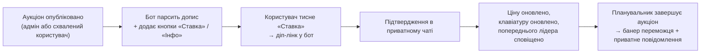

<div align="center">

# 🎮 Telegram-бот для аукціонів

**Додайте бота до свого Telegram-каналу та проводьте живі інтерактивні аукціони прямо з бота.**

Легкий бот на Node.js, що публікує аукціони у вашому каналі та керує ними — кожен з інлайн-кнопками **«Ставка»** та **«Інфо»** — відстежує учасників і поточну ціну та автоматично завершує аукціон банером із переможцем у визначений час.

[](https://nodejs.org)
[](https://github.com/WiseLibs/better-sqlite3)
[](https://core.telegram.org/bots/api)


**🌐 Мова:** [English](README.md) · **Українська**

</div>

---

## 📖 Зміст

- [Основне](#-основне)
- [Можливості](#-можливості)
- [Як це працює](#-як-це-працює)
- [Команди бота](#-команди-бота)
- [Адмін-панель](#-адмін-панель)
- [Налаштування](#-налаштування)
- [Створення аукціону](#-створення-аукціону)
- [Технології](#-технології)
- [Структура проєкту](#-структура-проєкту)
- [Запуск](#-запуск)
- [Ліцензія](#-ліцензія)

---

## ⭐ Основне

|  | |
|---|---|
| 🕒 **Безперервні аукціони** | Автоматично продовжує час завершення при ставках в останні хвилини, щоб запобігти «снайпінгу». |
| 🌍 **Двомовність** | Повний інтерфейс українською та англійською, перемикання з адмін-панелі. |
| 🤖 **AI-генерація** | Генерація назв і описів із фото за допомогою OpenAI. |
| 🔔 **Розумні сповіщення** | Сповіщення про перебиту ставку, власні нагадування та авто-попередження за 30 хв. |
| 📝 **Заявки користувачів** | Користувачі пропонують лоти; адміни переглядають, редагують і схвалюють. |
| 🛡️ **Панель під OTP** | Повне керування аукціонами та налаштуваннями за одноразовим паролем. |

---

## ✨ Можливості

<details open>
<summary><b>Ставки та аукціони</b></summary>

- **Ставка в один дотик із підтвердженням** — користувача переводить діп-лінком із каналу в приватний чат бота для підтвердження, що запобігає випадковим ставкам.
- **Безперервні аукціони** — ставка перед самим завершенням продовжує час (наприклад, +5 хв), запобігаючи ставкам в останню секунду.
- **Швидка відповідь на перебиту ставку** — сповіщення містить кнопку «Швидка ставка» для миттєвого підвищення.
- **Інтерактивна кнопка «Інфо»** — показує останніх учасників у короткому спливаючому вікні, об’єднуючи послідовні ставки одного користувача.
- **Надійне заплановане завершення** — на базі `node-schedule`; відновлює завдання після перезапуску та публікує банер переможця (або «без ставок»).

</details>

<details>
<summary><b>Користувачі та залученість</b></summary>

- **Підписки та власні нагадування** — підпишіться на будь-який аукціон і встановіть нагадування (за 1 / 2 / 3 / 6 / 12 год до завершення).
- **Автоматичне попередження про завершення** — за 30 хвилин усі активні учасники отримують сповіщення.
- **Сповіщення в реальному часі** — приватні повідомлення про перебиту ставку або перемогу.
- **Портфоліо та список спостереження** — `/menu` показує активні ставки, історію та відстежувані аукціони.
- **Автоматичний контакт переможця** — переможці отримують контакт адміністратора та посилання на допис.
- **Аукціони від користувачів** — подавайте лоти через бота з лімітами на користувача, опційним кроком підтвердження правил і глобальним перемикачем увімкнення/вимкнення.

</details>

<details>
<summary><b>Адміністрування та кастомізація</b></summary>

- **Просунута адмін-панель** — приватна панель під OTP для керування аукціонами, заявками та всіма налаштуваннями.
- **Майстер публікації аукціону** — покрокове створення (фото → назва → ціна → крок → дата завершення → безперервність → контакт).
- **AI-генерація аукціонів** — OpenAI (`gpt-4.1-mini`) перетворює завантажене фото на професійну назву й опис.
- **Кастомізовані шаблони** — редагуйте шапку, підвал і всі підписи полів прямо з бота.
- **Власна валюта** — будь-який символ або назва (₴, $, €, BTC, …) для всіх аукціонів.
- **Підтримка медіа** — показує фото аукціону та повний оригінальний текст на кроці підтвердження.
- **Розумний парсинг** — витягує назву лота, мінімальну ставку, крок і час завершення з дописів через динамічні регулярні вирази, що адаптуються до ваших підписів.

</details>

---

## 🧠 Як це працює



1. **Аукціон публікується** в каналі — адміністратором (майстер/вручну) або користувачем, чию заявку схвалено. Для заявок користувачів спершу може вимагатися крок **підтвердження правил**. Бот слухає `channel_post`, парсить деталі, зберігає аукціон і додає кнопки **«Ставка»** та **«Інфо»**.
2. **Користувач тисне «Ставка»** і переходить у бот через діп-лінк (`/start bid_CHATID_MSGID`).
3. **Підтвердження в боті** — показуються фото/текст лота та потрібна сума ставки; користувач підтверджує.
4. **Обробка** — бот перевіряє ціну, оновлює базу даних, оновлює клавіатуру в каналі та сповіщає попереднього лідера.
5. **Завершення аукціону** — планувальник запускає послідовність закриття, оновлює допис із переможцем і сповіщає його приватно.

---

## 💬 Команди бота

### 👤 Користувач

| Команда | Опис |
|---------|------|
| `/start` | Запустити бота та побачити привітання. |
| `/menu` | Головне меню — активні ставки, виграні аукціони, список спостереження та подання нових аукціонів. |
| `/my` | Активні ставки, де ви лідируєте або перебиті. |
| `/won` | Аукціони, які ви виграли. |
| `/about` | Інформація про бота та поточна версія. |

### 🔐 Адміністратор

| Команда | Опис |
|---------|------|
| `/admin` | Запросити OTP-код для автентифікації адміністратора. |
| `/admin_panel` | Відкрити інтерфейс керування (потрібна автентифікація). |

---

## 🛠️ Адмін-панель

Доступ до панелі у три кроки:

1. Надішліть `/admin` боту в приватному чаті.
2. Отримайте **OTP-код** і надішліть його назад.
3. Відкрийте інтерфейс керування командою `/admin_panel`.

<details>
<summary><b>Можливості панелі</b></summary>

- **⏳ Заявки на розгляді** — перегляд, редагування та схвалення аукціонів від користувачів.
- **➕ Опублікувати аукціон** — майстер: зображення → назва й опис (або **AI-генерація**) → мінімальна ставка → крок ставки → дата й час завершення → перемикач безперервності → контактний нікнейм.
- **📋 Списки активних / завершених** — перегляд і керування всіма аукціонами за категоріями.
- **🔍 Детальний перегляд** — поточна ціна, лідер (з посиланням на профіль) і дата завершення.
- **🏁 Завершити негайно** — миттєво закрити будь-який активний аукціон.
- **🔄 Перезапуск** — повторно опублікувати завершений аукціон із новою датою.
- **⚙️ Налаштування**
  - *Основні* — ID каналу, контактний нікнейм, ключ OpenAI API, мова, валюта, часовий пояс і хвилини продовження.
  - *Шаблон аукціону* — шапка, підвал і підписи (Мін. ставка, Крок ставки, Дата завершення).
  - *Значення за замовчуванням* — типова кількість днів і час для нових аукціонів, макс. активних аукціонів на користувача, посилання на правила та перемикач публікації аукціонів користувачами.
- **👥 Керування адмінами** — додавання чи видалення адміністраторів за Telegram User ID.
- **📢 Розсилка** — повідомлення всім користувачам, які взаємодіяли з ботом.

</details>

---

## ⚙️ Налаштування

Створіть файл `.env` з єдиною обов’язковою змінною:

```env
BOT_TOKEN=ваш_токен_бота   # Обов'язково
```

Усе інше — ID каналу, часовий пояс, контактний нікнейм, ключ OpenAI, мова, валюта та шаблони дописів — налаштовується через **адмін-панель** і зберігається в базі даних.

---

## 📝 Створення аукціону

Аукціони створюються **через бота** — форматувати дописи вручну не потрібно:

- **Майстер адміністратора** — відкрийте адмін-панель і виберіть **➕ Опублікувати аукціон**, далі пройдіть кроки (зображення → назва й опис → мінімальна ставка → крок ставки → дата завершення → безперервність → контакт). Бот опублікує аукціон у каналі з уже прикріпленими кнопками **«Ставка»** та **«Інфо»**.
- **Заявки користувачів** — користувачі подають лоти через бота; адміністратор переглядає та схвалює їх, і бот публікує їх так само.

> **Додатково / успадковане:** бот також розпізнає допис, набраний вручну, якщо він відповідає налаштованому формату підписів (Шапка аукціону, Мін. ставка, Крок ставки та Дата завершення — усі редагуються в адмін-панелі). Це лише резервний варіант — рекомендований спосіб створення аукціонів — майстер.

---

## 🧰 Технології

| Залежність | Призначення |
|------------|-------------|
| **node-telegram-bot-api** | Фреймворк Telegram Bot API |
| **better-sqlite3** | Вбудована база даних SQLite |
| **node-schedule** | Заплановане завершення аукціонів |
| **date-fns** / **date-fns-tz** | Робота з датами та часовими поясами |
| **openai** | Опційна AI-генерація назв/описів |
| **dotenv** | Конфігурація середовища |

> Потрібен **Node.js 18+**.

---

## 📁 Структура проєкту

```
src/
├─ bot.js               # Точка входу — підключає обробники, відновлює завдання
├─ config/env.js        # Змінні середовища та динамічні налаштування
├─ services/
│  ├─ db.js             # Схема та операції SQLite
│  ├─ i18n.js           # Локалізація UK/EN
│  └─ scheduler.js      # Завершення аукціонів і сповіщення
├─ handlers/
│  ├─ channelPost.js    # Обробка нових аукціонів із каналу
│  ├─ user/             # /start, /menu, /my, /won, ставки, інфо
│  └─ admin/            # Панель, автентифікація, налаштування, майстер публікації
├─ locales/             # Переклади (uk.json, en.json)
└─ utils/               # Спільні помічники та клавіатури
```

**База даних і міграції:** бот використовує SQLite (`auction.sqlite3`) і під час запуску автоматично додає відсутні стовпці/таблиці при оновленні.

---

## 🚀 Запуск

```bash
# 1. Встановити залежності
npm install

# 2. Додати токен бота
echo "BOT_TOKEN=ваш_токен_бота" > .env

# 3. Запустити
npm start
```

Потім надішліть `/admin` своєму боту, щоб автентифікуватися та завершити налаштування з панелі.

---

## 📜 Ліцензія

Розповсюджується за ліцензією **MIT**.
